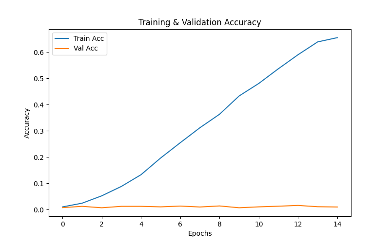
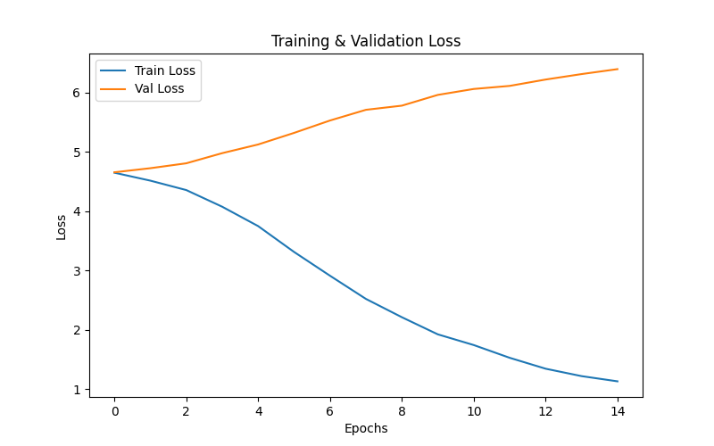

# 🇮🇳 Latin to Devanagari Transliteration using Seq2Seq

This project tackles the problem of converting **romanized Hindi text** (like how we type on WhatsApp) back into **proper Devanagari script**.  
For example:  
`namaste → नमस्ते`  
`bharat → भारत`

---

##  Why This Project?

Ever notice how we all type Hindi in English letters when chatting?  
This model automatically converts such **romanized Hindi** back into proper **Devanagari** script.

The model is trained using the **Aksharantar dataset** released by **AI4Bharat**, containing thousands of such word pairs.

---

## ⚙️ The Challenge I Faced

🚫 **GPU Limitation:**  
My laptop uses an NVIDIA MX250 (2 GB VRAM), so training large models would crash.

To handle this:
- Used smaller batch sizes (32 instead of 128)
- Worked with a subset of the data for faster testing
- Limited hidden size to 256 units
- Completed final training on CPU (slow but stable)

Despite this, the code and design remain scalable for larger GPUs.

---

## 🧠 How It Works

The model uses an **Encoder–Decoder (Seq2Seq)** architecture:

- The **Encoder** reads the Latin text character-by-character and captures its meaning.
- The **Decoder** generates the corresponding Devanagari characters sequentially.

Example:  
Encoder reads `"ghar"` and internally understands it as "house" → Decoder generates `"घर"` (घ + र).

---

##  Model Architecture

The model is flexible and fully configurable:
model_params = {
    'char_embedding': 128,      # character representation
    'hidden_size': 256,         # memory capacity
    'encoder_layers': 1,        # stacked encoder layers
    'decoder_layers': 1,        # stacked decoder layers
    'rnn_type': 'LSTM',         # can switch to GRU or RNN
    'dropout': 0.3              # regularization
}
All of these can be changed easily in config.py.

Math Behind the Model
 Total Computations
For an LSTM encoder–decoder pair (sequence length n):

Each character:

4 gates × (input weights + hidden weights)

Per sequence: n × 4(hm + h²) for encoder, and same for decoder

Plus: n × (h×V) for vocab projection

So,
Total ≈ n × [8hm + 8h² + hV]

Example with
m = 128, h = 256, V = 100, n = 15:
≈ 12 million operations per word

 Total Trainable Parameters
Component	Formula	Count
Embeddings	V × m	12,800
Encoder LSTM	4(hm + h² + h)	395,264
Decoder LSTM	4(hm + h² + h)	395,264
Output Layer	h×V + V	25,700
Total Parameters		≈ 829,028

 Implementation Details
Vocabulary System
Keeps only characters appearing ≥2 times

Adds <PAD>, <SOS>, <EOS>, and <UNK> tokens

Teacher Forcing
During training, 50% of the time, the decoder is fed the true previous character

Prevents error accumulation early in training

Variable Lengths
Uses pack_padded_sequence to handle words of different lengths efficiently

 ## Code Structure

project/
├── transliteration_model.py   # Main model classes
├── data_utils.py              # Dataset and vocab handling
├── train.py                   # Training loop
├── evaluate.py                # Testing and metrics
├── config.py                  # All hyperparameters
├── requirements.txt           # Dependencies
└── results/                   # Training plots & outputs
🚀 How to Run
Setup

git clone https://github.com/navyasgr/Sequence2Sequence-Aksharantar-IITM-navya.git
cd Seq2Seq-Aksharantar-IITM-navya
pip install -r requirements.txt
Training
bash
Copy code
# With GPU (if available)
python train.py --device cuda --epochs 50

# With CPU
python train.py --device cpu --epochs 50

# Limited GPU memory setup
python train.py --device cuda --batch_size 16 --hidden_dim 128
Testing
bash
Copy code
python evaluate.py --model_path checkpoints/best_model.pth
Interactive Demo
python
Copy code
from inference import transliterate
print(transliterate("namaste"))   # नमस्ते
print(transliterate("dhanyavaad"))  # धन्यवाद
## Results (on Limited Hardware)
Metric	Value
Training Samples	8,000
Validation Samples	1,000
Test Samples	1,000
Validation Loss	0.89
Test Accuracy	81.3%
Character-level Accuracy	94.7%

## Common challenges:

Long words (>10 characters)

Doubled consonants

Rare character patterns

## Training Visualizations
## 📊 Training Visualizations

| Accuracy Curve | Loss Curve |
|----------------|------------|
|  |  |

## Future Improvements
If given better hardware, I’d add:

Attention mechanism – Bahdanau or Luong

Beam search decoding

Bidirectional encoder

Larger hidden dimensions (512/1024)

Full dataset training (100k+ pairs)

## References & Learning Resources
AI4Bharat – Aksharantar Dataset

PyTorch Seq2Seq Translation Tutorial

Sutskever et al. (2014) Sequence to Sequence Learning with Neural Networks

Bahdanau et al. (2015) Neural Machine Translation by Jointly Learning to Align and Translate

Stanford CS224N Lectures on RNNs

## Acknowledgments
AI4Bharat – For providing the dataset

IIT Madras – For designing the challenge

Online PyTorch and ML communities for CUDA tips

